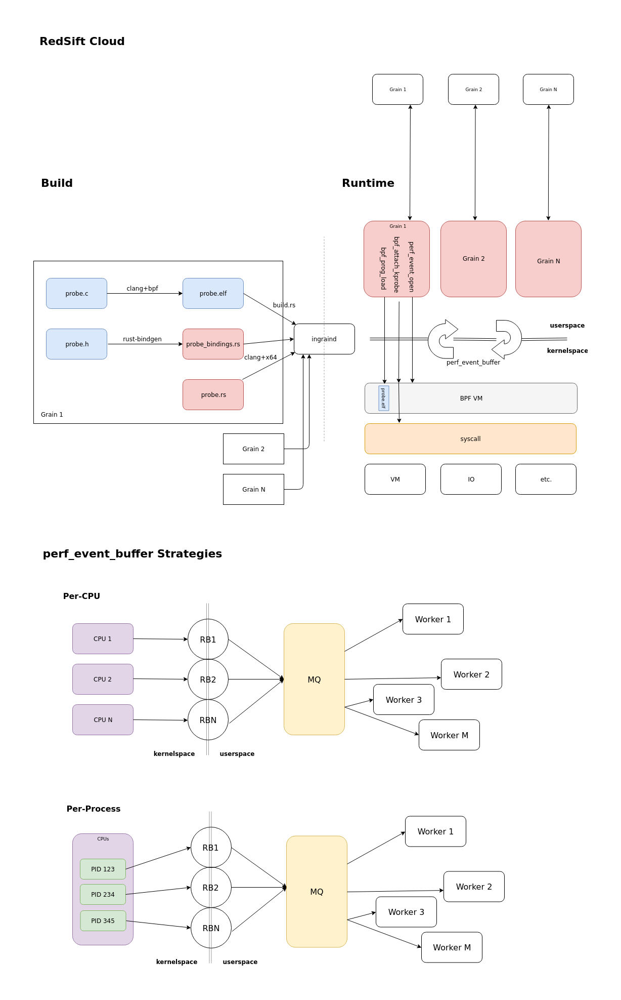

ingrainD
========

Data-first monitoring.

InGrain is a security monitoring software for complex containerized
environments and endpoints. The ingraind agent is built around eBPF probes to
provide safe and performant instrumentation for any Linux-based environment.

In conjunction with the RedSift Cloud, InGrain provides oversight of assets and
risks:
 * Your customer data - an employee copying your customer database to their
   personal cloud store.
 * Your infrastructure - an attacker executing a zero day attack to gain access
   to your web servers.
 * Your resources - malware using your users machines compute resources to mine
   cryptocurrency.

## Requirements
 
 * LLVM/Clang
 * Rust toolchain [rustup.rs](https://rustup.rs)
 * [BCC](https://github.com/iovisor/bcc)
 * Linux 4.4 or newer + headers
 
## Supported host OS

Currently, only Arch Linux is supported as a build environment. The kernel
version is dependent on `uname` output, so build cannot be trivially
containerised at the moment.

## Compile

Compilation on Arch Linux will pick up the currently installed source tree using
`pacman`.

On other distributions, set the `KERNEL_SOURCE` environment variable with the
path to the kernel source tree.

Please note that this actually needs to be a **dirty** source tree of an actual
kernel, not just a version compatible bare source tree.

The usual Rust compilation ritual will produce a binary in `target/release`:

    cargo build --release
    
To build a Docker container, make sure `kernel` directory is populated with the
source tree of the target kernel.

The resulting container is tagged `ingraind` by default, but you can set
additional tags or pass `docker` flags like so:

    docker/build.sh -t ingraind:$(git rev-parse HEAD | cut -c-7)
    
## Run

There are several environment variables that are picked up on start:
 * `AWS_ACCESS_KEY_ID=`: AWS access key
 * `AWS_SECRET_ACCESS_KEY=`: AWS secret key
 * `AWS_BUCKET=`: Target bucket for JSON files in S3
 * `AWS_INTERVAL=`: Commit interval for the S3 backend, in seconds
 * `STATSD_HOST=`: Host name/IP address of the statsd server
 * `STATSD_PORT=`: Statsd port
 
The bare binary can be run as such:
 
    sudo RUST_BACKTRACE=1 \
         AWS_ACCESS_KEY_ID=xxx \
         AWS_SECRET_ACCESS_KEY="xxx" \
         AWS_BUCKET=xxx \
         AWS_INTERVAL=30 \
         ./target/release/ingraind
         
The docker container is portable even across kernel versions, but make sure that
the output is validated before putting it in production. Start it like so:

    docker run -e AWS_ACCESS_KEY_ID=xxx \
               -e AWS_SECRET_ACCESS_KEY="xxx"  \
               -e AWS_BUCKET=xxx \
               -e AWS_INTERVAL=10 \
               --name ingraind  \
               --pid=host  \
               --net=host  \
               --privileged  \
               -v /sys:/sys  \
               ingraind:latest
    
## Repo structure

The `bpf` directory contains the BPF modules. These are compiled by `build.rs`,
and embedded in the final binary, and will be managed by the grains.

On top of this, there are several crates that make up `ingraind`.
These are:

 * `bpf-sys`: Bindings to `libbpf.so`, a part of BCC. This is a ~40KiB `.so`, so
   easy to redistribute under Apache 2.
 * `redbpf`: High-level BPF runtime library. It loads ELF binaries, and handles
   `perf_event` interaction.
 * root: the main application code
 
## How it all works

### Build

Build starts with `build.rs` going through all modules in the `bpf/` directory, and:

 1. Compile all `.c` files with `clang` into BPF bytecode.
 1. Run `bindgen` for all structs, the names of which start with `_data_` (e.g.
    `_data_tcp_connect`).
    
`bpf_helpers.h` is in the `include` directory, so `bindgen` can be run freely on
all `.h` files under `bpf/`. This is quirky, but works.

The produced BPF bytecode ELF packages are embedded in the final binary
using `include_bytes!` statements.
The produced bindings are embedded using `include!` statements.
 
### Runtime

**Grains** are self-contained monitors and reporters. Each grain can gather their
own type of statistics about a particular aspect of the system's operation.
Grains need to manage any BPF modules they might be using. Every grain is
coupled with a dedicated cloud-based analytics backend.

**BPF** probes are using the kernel's eBPF virtual machine to execute a safe
bytecode directly in kernel-space. These modules can only interact with the
outside world using well-defined interfaces, and cannot execute arbitrary system
calls.

The BPF modules will send data to userland using **perf_event** ring-buffers.
These ring-buffers are fixed size buffers with a size multiples of the platform
native VMM page size (4k on x86/x64).

Important to note 2 things:
 * The license of BPF modules needs to be GPL is we want to extract data from
   the kernel into userland through the `perf_event` interface.
 * If the module's version does not match the running kernel's version number,
   the kernel will refuse to load the module. The workaround here is using
   `0xFFFFFFFE` in the binary to stay compatible with gobpf. This version will
   be replaced runtime by redbpf.

After the BPF probes are parsed from the ELF files, the following syscalls are
made, in order:
 1. `bpf_create_map`: All global data is stored in maps. These structures are
    allocated during parsing.
 1. `bpf_prog_load`: Load a program into the BPF VM, and initialise it
 1. `bpf_attach_kprobe`: Attach BPF probes to a syscall. Entry probes and return
    probes are possible, they will be called when entering or exiting a syscall,
    respectively.
 1. `bpf_update_elem`: the `perf_event` ringbuffers are initialised. This
    includes allocating a `perf_reader` object, which are used for userspace
    consumption of the `bpf_perf_event_output` calls in the probes.
    
### Perf Events

In the BPF probes, the `bpf_perf_event_output` call will send the data to
userspace. There's a copy that will happen here, into the ring buffer.

The userspace needs to set up the `BPF_MAP_PERF_EVENT_ARRAY` before initialising
the program, and call `bpf_perf_event_open` with a callback, CPU ID, and some
other things. This call will allocate a `perf_reader`, that then needs to be
`free`'d eventually.

The userspace view into the `BPF_MAP_PERF_EVENT_ARRAY` will contain these
`perf_reader`s as values, keyed by e.g. the CPU IDs.

These `perf_reader`s need to be `perf_reader_poll`'d periodically, and the
`perf_reader` will call the callbacks passed in at initialisation.

Therefore, there's a `perf_reader` and an associated ringbuffer *per CPU*, *per
PID*, or other meaningful categorisation for the usecase.

Per-CPU aggregation is meaningful when monitoring an entire system. The
perf_event output in this case is necessarily bound to CPUs, therefore it makes
sense to use CPU-local ring buffers to maximise throughput.

Per-PID aggregation are useful when running process/socket-specific tracers. The
performance implication of this strategy is unclear at this point.
    
### ELF parsing

A thing to note here before I get into this, is how state is managed in the BPF
VM. There's no global state allowed, so anything that needs to be persisted
between calls into the probe needs to go through `BPF_MAP_.*` structures through
VM opcodes (`#define`'d as function calls, eg. update, delete, etc.).

A corollary to this is that global state used in the [C source
code](https://elixir.bootlin.com/linux/v4.17.1/source/tools/lib/bpf/libbpf.h#L209)
is stored in the ELF binary in named `PROGBITS`
[sections](https://docs.rs/goblin/0.0.15/goblin/elf/section_header/struct.SectionHeader.html),
then loaded and initialised to be `BPF_MAP`s by the loader *as data*. We load
this into memory, treating it as configuration, then instruct the kernel to set
up global state storage to get an `fd` in return. This `fd` can also be used to
send data back and forth between kernel- and userspace in certain cases.

It gets interesting when these are referenced in code (functions). The compiler
generates a `REL`
[section](https://docs.rs/goblin/0.0.15/goblin/elf/reloc/struct.Reloc.html) that
`link`s to the symbol table, and has an `info` field that is a link to the
amended section of code. The `offset` field specifies the offset in bytes from
the start of the section that needs to be modified. A relocation, strictly in
the BPF context, is a rewrite instruction for a specific instruction, in a
specific section, referencing a specific symbol.

Because data access is always through VM opcodes, the instruction at the
`offset` location is... something. We don't actually care. Relocations tell us
to... do something with it.

We need to rewrite the instruction's source register (`src_reg`) with
`BPF_PSEUDO_MAP_FD`, and the immediate constant parameter (`imm`) with the `fd`
of the map that's referenced by the symbol.

So to recap, this is the workflow to deal with loading ELF files:
 1. Load the strings table
 1. Load the symbol table
 1. Parse *all* the sections
 1. Create `BPF_MAP`s from the `maps/` sections to acquire `fd`s
 1. Go through all code sections, and apply relocations such that:
    1. Resolve all `REL` symbols into `fd`s (through the symbol table and back again).
    1. Rewrite the instruction at specified offset

